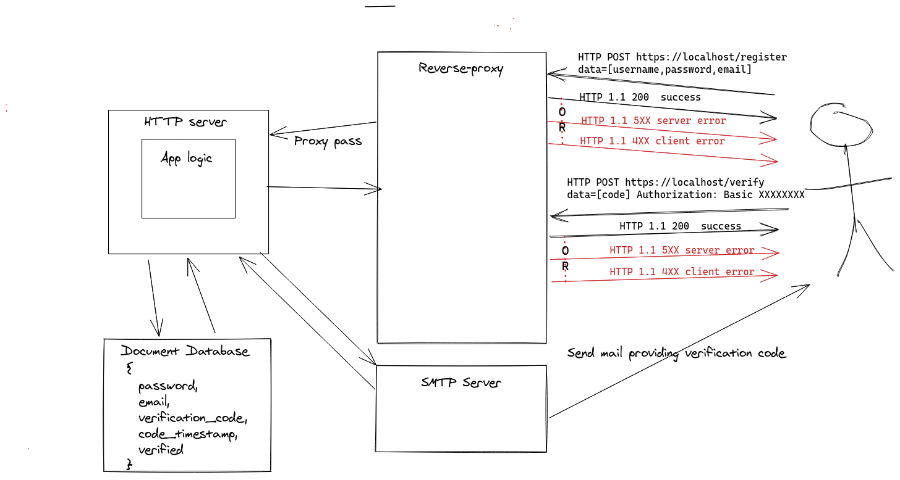

## Run app
```sh
docker-compose up -d
```
## API documentation
Using curl to illustrate practical examples, using --insecure as the SSL certificate is self-signed here :

```sh
#Submit a user creation request
curl --insecure -d "username=testusername&password=testpassword&email=foo@bar.com" -X POST https://localhost/register
#An email is sent, containing a verification code, (for the sake of the exercise, the code is also returned by the previous request as an HTTP data) get that code and use it to validate the creation  
curl --insecure -d "verification_code=1234" -X POST https://localhost/verify
```
## Run tests

## Architecture


